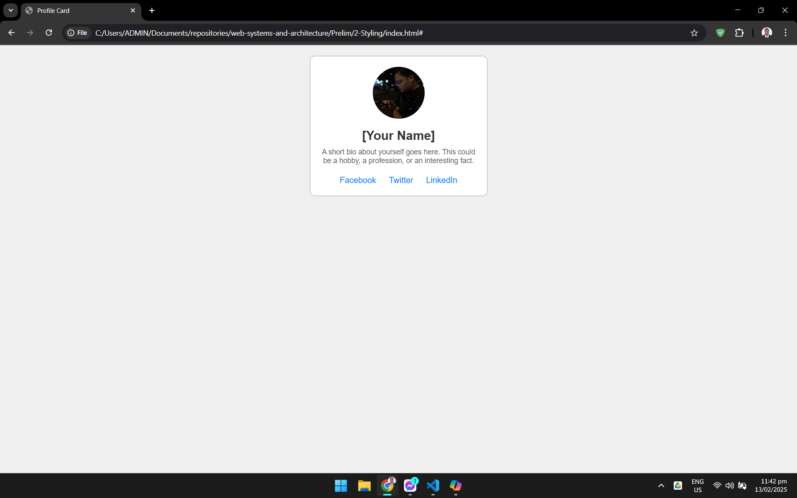

_(For better viewing, press Ctrl + Shift + V to enter Preview moode)_

# __IN-DEPTH DISCUSSION ABOUT `<div>` AND CLASS AND ID ATTRIBUTE__

## __`<div>`__
The `<div>` element is a block-level container used to group other HTML elements. It has no specific meaning or styling on its own but is a powerful tool for organizing and structuring your HTML content.

__Example:__
```html
<div>
    <p>This is a paragraph inside a div.</p>
    <p>This is another paragraph inside the same div.</p>
</div>
```

## ` class="" ` & ` id="" `
The `class=""` and `id=""` attributes in HTML are used to assign specific names to elements. These attributes are essential for targeting and styling elements with CSS or manipulating them with JavaScript.

### Class Attribute `(class="")`
The class attribute allows you to assign one or more class names to an HTML element. Class names are used to group elements together and apply the same styles or behaviors to all elements with that class.

__Example:__
```html
<p class="highlight">This paragraph has a class attribute with the value "highlight".</p>
<div class="container main-content">This div has two class names: "container" and "main-content".</div>
```
In this example:
- The paragraph element has a class attribute with the value "highlight".
- The div element has a class attribute with two class names: "container" and "main-content". Multiple class names are separated by spaces.

### ID Attribute `(id="")`

The id attribute assigns a unique identifier to an HTML element. Each id must be unique within the entire HTML document. The id attribute is often used for a single element to apply a specific style or behavior.

__Example:__
```html
<p id="special">This paragraph has an id attribute with the value "special".</p>
<div id="header">This div has an id of "header".</div>
```

In this example:
- The paragraph element has an id attribute with the value "special".
- The div element has an id attribute with the value "header".
---
---
<br>

# __BEST PRACTICES WHEN WRITING HTML CODE__

## 1. __USE SEMANTIC HTML__<br/>
Semantic HTML tags (like `<header>`, `<article>`, `<section>`, and `<footer>`) provide meaning to the content they enclose, making your code more readable and accessible.

__Example:__
```html
<header>
    <h1>Welcome to My Website</h1>
</header>
<section>
    <article>
        <h2>Article Title</h2>
        <p>This is an article.</p>
    </article>
</section>
<footer>
    <p>&copy; 2025 My Website</p>
</footer>
```

## 2. __INDENTATION AND FORMATTING__ <br/>
Proper indentation and formatting make your HTML code more readable and easier to maintain. Use consistent indentation (e.g., 2 or 4 spaces) for nested elements.

__Example:__
```html
<!DOCTYPE html>
<html lang="en">
<head>
    <meta charset="UTF-8">
    <meta name="viewport" content="width=device-width, initial-scale=1.0">
    <title>My Webpage</title>
</head>
<body>
    <header>
        <h1>Welcome to My Website</h1>
    </header>
    <section>
        <article>
            <h2>Article Title</h2>
            <p>This is an article.</p>
        </article>
    </section>
    <footer>
        <p>&copy; 2025 My Website</p>
    </footer>
</body>
</html>
```

## 3. Code Segregation Using `<div>` Elements <br/>
Code segregation refers to the practice of organizing and grouping related code together for better readability, maintainability, and structure. In HTML, `<div>` elements are commonly used for this purpose.
### Importance of Using `<div>` for Code Segregation
#### i. Organizing Content:
- `<div>` elements help group related content together, making the HTML structure more organized and easier to understand.
- For example, you can group a header, main content, and footer within their respective `<div>` containers.

__Example:__
```html
<div id="header">
    <h1>Website Header</h1>
</div>

<div id="main-content">
    <p>This is the main content area.</p>
</div>

<div id="footer">
    <p>Website Footer</p>
</div>
```
#### ii. Applying Styles and Scripts
- By segregating content using `<div>`, you can apply styles and scripts more effectively.

- You can target specific `<div>` containers with CSS classes or IDs to style or manipulate them with JavaScript.

__Example:__

__HTML:__
```html
<div class="container">
    <h2>Section Title</h2>
    <p>This is a section within a container.</p>
</div>
```

__CSS:__
```css
.container {
    border: 1px solid #ccc;
    padding: 20px;
    background-color: #f9f9f9;
}
```

#### iii. Improving Accessibility:

- Properly organized content within <div> elements can enhance accessibility by providing a clear structure for screen readers and other assistive technologies.

#### iv. Simplifying Maintenance:

- Grouping related code together within <div> elements simplifies the process of updating or modifying content, as you can easily locate and manage specific sections of the HTML.

## 4. Use Meaningful Names for IDs and Classes
Choose clear and descriptive names for your IDs and classes to make your code more understandable.

__Example:__
__HTML:__
```html
<div id="main-content" class="article-container">
    <p class="highlighted-text">This is a highlighted paragraph.</p>
</div>
```

## 5. Close All Tags
Ensure that all tags are properly closed, even for self-closing tags like ``, `<br>`, and `<hr>`.

__Example:__

__HTML:__
```html

<br />
```

## 6. Keep Code DRY (Don't Repeat Yourself)
Reuse code where possible to avoid redundancy. Use classes instead of inline styles to apply the same styles to multiple elements.

__Example:__

__HTML:__
```html
<!-- Instead of using inline styles repeatedly -->
<p style="color: blue;">This is a paragraph.</p>
<p style="color: blue;">This is another paragraph.</p>

<!-- Use a class for reusable styles -->
<p class="blue-text">This is a paragraph.</p>
<p class="blue-text">This is another paragraph.</p>
```

## Provide Alt Text for Images
Always include the alt attribute for  tags to improve accessibility and SEO.

__Example:__

__HTML:__
```html

```

## 8. Use External Stylesheets and Scripts
Link to external stylesheets and scripts instead of using inline styles and scripts to keep your HTML clean and maintainable.

__Example:__

__HTML:__
```html
<head>
    <link rel="stylesheet" href="styles.css">
    <script src="scripts.js"></script>
</head>
```
## 9. Validate Your HTML
Use an HTML validator to check for errors and ensure your code adheres to standards.

__Examples:__ You can use the W3C Markup Validation Service to validate your HTML code.
## 10. Use Comments
Add comments to your code to explain sections and provide context for future maintenance.

__Example:__

__HTML:__
```html
<!-- This is the main content area -->
<div id="main-content">
    <p>This is a paragraph.</p>
</div>
```

## 11. Avoid Deprecated Tags and Attributes
Use modern HTML tags and attributes, and avoid deprecated ones like `<font>`, `<center>`, and bgcolor.

---
---
<br>

# __CSS__

## __What is CSS?__
CSS stands for Cascading Style Sheets. It is a stylesheet language used to describe the presentation of a document written in HTML or XML (including SVG, MathML, or XHTML). CSS is a cornerstone technology of the World Wide Web, alongside HTML and JavaScript.

## __Purpose of CSS__
The primary purpose of CSS is to separate the content of a web page (written in HTML) from its presentation. This includes aspects such as layout, colors, fonts, and overall visual appearance. By using CSS, developers can create visually appealing websites that are easier to maintain and update.

## __Key Features of CSS__
1. Separation of Content and Presentation: CSS allows you to keep the HTML structure clean and focused on content, while the CSS handles all the styling. This separation makes it easier to manage and update the look and feel of a website.

2. Reusability: CSS styles can be reused across multiple HTML pages, ensuring consistency in design and reducing the need to duplicate code.

3. Efficiency: By using external stylesheets, you can apply the same styles to multiple web pages, which can improve load times and reduce bandwidth usage.

4. Flexibility: CSS provides a wide range of styling options, from basic text and color changes to complex animations and responsive designs that adapt to different screen sizes.

## __Types of CSS__
There are three main types of CSS:

1. __Inline CSS__: Applied directly within an HTML element using the style attribute.

```html
<p style="color: blue; font-size: 18px;">This is a paragraph with inline styles.</p>
```

2. __Internal CSS__: Defined within a `<style>` tag inside the `<head>` section of an HTML document.
```html
<head>
    <style>
        p {
            color: red;
            font-size: 20px;
        }
    </style>
</head>
```

3. __External CSS:__ Defined in a separate CSS file and linked to an HTML document using the `<link>` tag.

```html
<link rel="stylesheet" href="styles.css">
```

## __Basic Structure of CSS__
A CSS rule consists of a selector and a declaration block. The selector specifies which HTML elements the rule applies to, and the declaration block contains one or more declarations that define the styles to be applied.

### Example:
```css
selector {
    property: value;
    property: value;
}
```

- __Selector__: Targets the HTML element to be styled.

- __Property__: Specifies the style attribute to be applied (e.g., color, font-size, margin).

- __Value__: Specifies the value for the property (e.g., blue, 16px, 10px).

### Example:
```css
p {
    color: blue;
    font-size: 18px
}
```

## __CSS Selectors__
CSS selectors are patterns used to select and target HTML elements so that you can apply styles to them. They are a fundamental part of CSS and allow you to define the appearance and layout of web pages in a flexible and powerful way.

### __Types of CSS Selectors__
#### __1. Universal Selector__
- Targets all elements on the page.
```css
* {
    margin: 0;
    padding: 0;
}
```
#### __2. Type Selector__
- Targets elements by their tag name.
```css
p {
    color: blue;
}
```
#### __3. Class Selector__
- Targets elements with a specific class attribute. It uses a period (.) followed by the class name.
```css
.highlight {
    background-color: yellow;
}
```
#### __4. ID Selector__
- Targets a single element with a specific id attribute. It uses a hash (#) followed by the id name.
```css
#special {
    color: green;
}
```

#### __5. Attribute Selector__
- Targets elements with a specific attribute.
```css
input[type="text"] {
    border: 1px solid #ccc;
}
```

#### __6. Descendant Combinator `( )`__
- Targets elements that are descendants (children, grandchildren, etc.) of a specified ancestor.
```css
div p {
    color: red;
}
```

#### __7. Child Combinator `(>)`__
- Targets direct child elements of a specified parent element.
```css
div > p {
    color: purple;
}
```

#### __8. Adjacent Sibling Combinator (+)__
- Targets an element that is immediately preceded by a specified sibling element.
```css
h2 + p {
    color: orange;
}
```

#### __9. General Sibling Combinator (~)__
- Targets all sibling elements that follow a specified sibling element.
```css
h2 ~ p {
    color: pink;
}
```

#### __10. Pseudo-Class Selector__
- Targets elements based on their state or position.
```css
a:hover {
    color: red;
}
```

#### __11. Pseudo-Element Selector__
- Targets specific parts of an element.
```css
p::first-line {
    font-weight: bold;
}
```

#### __12. Grouping Selector__
- Applies the same styles to multiple elements.
```css
h1, h2, h3 {
    font-family: Arial, sans-serif;
}
```
---
---
<br/>

# PROJECT II: Profile Card

## __Instruction:__ <br/>
Create a profile card using HTML and basic CSS. The card should include a profile picture, name, short bio, and social media links.

## __Example:__


> ## __ATTENTION: HOW TO SUBMIT PROJECT__
><br/>
> Submit link of repo's live preview.
> <br/>
> <br/>

> 
